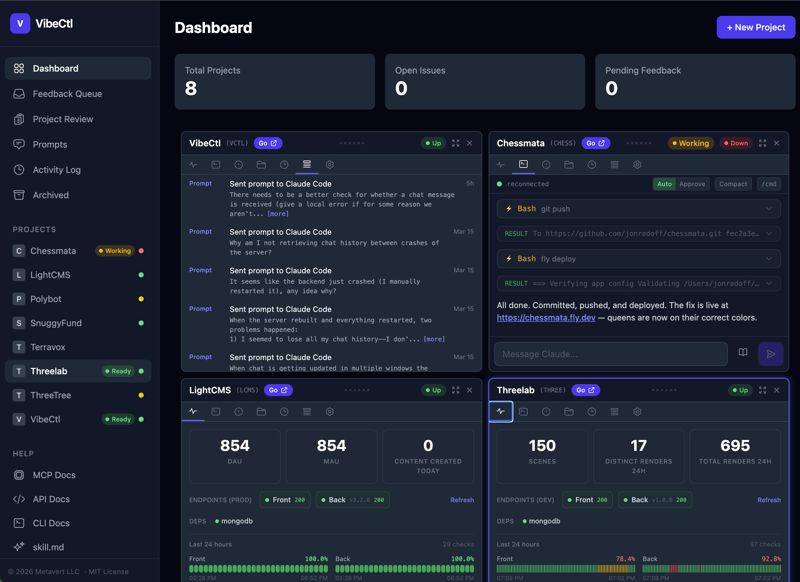

# VibeCtl

**Command-and-control for the agentic coding era.**

VibeCtl is a self-hosted project management system built for the way software is actually made today: AI agents doing the coding, humans directing strategy. It unifies issue tracking, deployment management, health monitoring, and product feedback into one integrated workflow designed around Claude Code and similar agentic tools.

> *We're entering software's creator era — where the gap between idea and working product has collapsed. VibeCtl is the cockpit for that new reality.*



## Why VibeCtl

Modern agentic development creates a new coordination problem: you're running multiple AI-assisted projects simultaneously, context windows are finite, and the pace is fast. Jira is too heavyweight. Linear doesn't know about your deployments. GitHub Issues doesn't understand your architecture.

VibeCtl provides:
- A **VIBECTL.md** file per project — the single source of truth that agents read before every session
- An **MCP server** that agents use directly, without leaving Claude Code
- A **CLI** for terminal-native workflows and automation
- A **web UI** for visual project management and monitoring
- **Health checks** that know the difference between "frontend is down" and "backend /healthz is degraded"
- **Feedback triage** backed by Claude — user reports automatically convert to issues

---

## Features

### Projects & Issues
- Projects with codes (`LCMS`, `MYAPP`, etc.), goals, links, and deployment config
- Issues with types (bug / feature / idea), priorities (P0–P5), and type-specific status workflows
- Full-text search across all issues
- Decision audit log — every status change is recorded

### Health Monitoring
- Per-project health check endpoints (dev + prod URLs for frontend and backend)
- Backend uses the [VibeCtl Health Check Protocol](#health-check-protocol) (`/healthz`)
- Frontend uses simple 200-response check (no /healthz required)
- 24-hour uptime timeline, 7-day history stored in MongoDB
- Auto-polls every 10 minutes in the background

### VIBECTL.md Generation
- Auto-generates a structured markdown file in your project directory
- Contains: open issues by priority, deployment info, recent decisions, architecture summary
- Claude Code reads this on startup — `include: VIBECTL.md` in `settings.json`

### Feedback Queue
- Collect feedback from GitHub comments, manual input, or API
- AI triage with Claude: matches to existing issues or proposes new ones
- Recurring theme detection across feedback

### Sessions & Activity
- Work session tracking — log what was worked on, summaries
- Activity log for all significant events
- Chat history for Claude Code sessions

### CLI (`vibectl`)
- Full project management from the terminal
- Auth token stored in `~/.vibectl/token`
- `--format json` for scripting

### MCP Server
- Local stdio transport — no HTTP, no port, works directly with Claude Code
- 20 tools covering projects, issues, sessions, health, prompts, and decisions
- See [skill.md](skill.md) for full tool reference

### Admin Authentication
- Admin password stored bcrypt-hashed in MongoDB (never in a file)
- Session tokens generated on login, rotated on each auth
- Protected endpoints: rebuild, password change

---

## Quick Start

### Prerequisites
- Go 1.21+
- Node.js 18+ (for frontend)
- MongoDB (local or Atlas)

### Setup

```bash
# Clone and enter the project
git clone https://github.com/jonradoff/vibectl
cd vibectl

# Copy environment config
cp .env.example .env
# Edit .env: set MONGODB_URI, ANTHROPIC_API_KEY

# Start the server (builds + runs binary with auto-restart)
make dev

# In another terminal, start the Vite dev server (optional, for UI)
make frontend-dev
```

The server runs on `:4380`, the Vite dev server on `:4370`.

### Build the CLI

```bash
make build-cli
# Installs to ./cli/vibectl (or add to PATH)
```

### Configure MCP in Claude Code

Add to `~/.claude.json` (user scope) or `.mcp.json` (project scope):

```json
{
  "mcpServers": {
    "vibectl": {
      "command": "/path/to/vibectl/vibectl-mcp",
      "args": [
        "--mongodb-uri", "mongodb://localhost:27017",
        "--database", "vibectl"
      ]
    }
  }
}
```

Or with Atlas:
```json
{
  "mcpServers": {
    "vibectl": {
      "command": "/path/to/vibectl/vibectl-mcp",
      "args": ["--mongodb-uri", "mongodb+srv://...", "--database", "vibectl"]
    }
  }
}
```

**Privacy Policy:** VibeCtl's MCP server connects directly to your local MongoDB instance. No data is sent to external servers by the MCP server itself. See [https://www.metavert.io/privacy-policy](https://www.metavert.io/privacy-policy) for full details.

---

## CLI Reference

```
vibectl <command> <action> [flags]
```

### Authentication

```bash
vibectl admin set-password        # Set password (first run: leave current blank)
vibectl admin login               # Authenticate, saves token to ~/.vibectl/token
vibectl admin logout              # Remove saved token
```

### Projects

```bash
vibectl projects list
vibectl projects create --name "My App" --code MYAPP --local-path /code/myapp
```

### Issues

```bash
vibectl issues list MYAPP
vibectl issues list MYAPP --priority P0 --status open
vibectl issues create MYAPP --title "Login fails on mobile" --type bug --priority P1 \
  --repro-steps "Open on iPhone, tap Login"
vibectl issues view MYAPP-0042
vibectl issues status MYAPP-0042 fixed
vibectl issues search "authentication timeout"
```

### Health

```bash
vibectl health MYAPP              # Current health check
vibectl health history MYAPP      # 24-hour uptime history
```

### Sessions & Prompts

```bash
vibectl sessions MYAPP --limit 5
vibectl prompts list MYAPP
vibectl prompts get <id>
```

### Dashboard & Decisions

```bash
vibectl dashboard
vibectl decisions MYAPP --limit 10
vibectl generate-md MYAPP
vibectl generate-md --all
```

### Global Flags

```
--format json      Output raw JSON (for scripting)
```

### Environment Variables

| Variable | Default | Description |
|----------|---------|-------------|
| `VIBECTL_URL` | `http://localhost:4380` | Server base URL |
| `VIBECTL_TOKEN` | (reads `~/.vibectl/token`) | Bearer auth token |

---

## MCP Working Examples

The MCP server provides 20 tools for Claude Code. Here are 5 working examples:

### 1. Get project status before starting work

```
Use vibectl MCP tool: get_vibectl_md(projectCode: "LCMS")
```

Returns the full VIBECTL.md — open issues by priority, deployment commands, recent decisions, architecture summary, and goals. Claude Code should read this at the start of every session.

### 2. Create a bug after finding a regression

```
Use vibectl MCP tool: create_issue(
  projectCode: "LCMS",
  title: "Upload fails when filename contains spaces",
  description: "File upload returns 400 when the original filename has spaces. The server does not URL-encode the filename before storage.",
  type: "bug",
  priority: "P1",
  reproSteps: "1. Pick a file named 'my document.pdf'\n2. Click Upload\n3. See 400 Bad Request"
)
```

### 3. Search for existing issues before filing a new one

```
Use vibectl MCP tool: search_issues(query: "upload filename spaces", projectCode: "LCMS")
```

Returns matching issues scored by relevance. If none exist, proceed to create.

### 4. Close an issue and log the decision

```
# First, transition the issue to fixed
Use vibectl MCP tool: update_issue_status(issueKey: "LCMS-0017", newStatus: "fixed")

# Then record the architectural decision that resolved it
Use vibectl MCP tool: record_decision(
  projectCode: "LCMS",
  summary: "Fixed upload filename handling by URL-encoding in the storage layer (pkg/storage/upload.go). Chose server-side encoding over client-side to keep the API surface simple.",
  issueKey: "LCMS-0017"
)
```

### 5. Check what's broken in production

```
# Get deployment and health config
Use vibectl MCP tool: get_deployment_info(projectCode: "LCMS")

# Get 24-hour uptime history
Use vibectl MCP tool: get_health_status(projectCode: "LCMS")
```

Returns structured health records showing status per endpoint over time. Cross-reference with deployment info to identify when a deploy caused degradation.

---

## Configuration

### Environment Variables (`.env`)

| Variable | Required | Description |
|----------|----------|-------------|
| `MONGODB_URI` | Yes | MongoDB connection string |
| `DATABASE_NAME` | No | Database name (default: `vibectl`) |
| `PORT` | No | HTTP port (default: `4380`) |
| `ANTHROPIC_API_KEY` | No | Enables AI triage, PM review, architecture agents |
| `GITHUB_TOKEN` | No | Enables GitHub comment sweeper |
| `ALLOWED_ORIGINS` | No | CORS origins (default: `*`) |

---

## Health Check Protocol

VibeCtl implements a health check standard for backend services. Add a `/healthz` endpoint that returns:

```json
{
  "status": "healthy",
  "name": "MyApp Backend",
  "version": "1.2.3",
  "uptime": 86400,
  "dependencies": [
    { "name": "mongodb", "status": "healthy" }
  ],
  "kpis": [
    { "name": "active_users", "value": 142, "unit": "count" }
  ]
}
```

**Status values**: `healthy`, `degraded`, `unhealthy`

Frontend apps don't need `/healthz` — VibeCtl checks that the main URL returns a non-5xx response.

The `pkg/healthz` package implements this protocol for Go services:

```go
import "github.com/jonradoff/vibectl/pkg/healthz"

checks := map[string]healthz.CheckFunc{
    "mongodb": func() error { return db.Ping(ctx, nil) },
}
kpis := func() []healthz.KPI {
    return []healthz.KPI{{Name: "open_issues", Value: 5, Unit: "count"}}
}
r.Get("/healthz", healthz.Handler("1.0.0", checks, kpis))
```

---

## Development

```bash
make dev              # Build + run server with auto-restart on crash
make frontend-dev     # Vite dev server on :4370 with HMR
make build            # Full build (server + CLI + MCP binary)
make build-server     # Server binary only
make check            # Type-check (Go + TypeScript)
```

### Rebuild after Go changes

```bash
curl -X POST http://localhost:4380/api/v1/admin/rebuild
```

The server rebuilds itself in-place (same PID, no downtime) and the UI shows a "rebuilding" overlay.

### Project Structure

```
cmd/
  server/     HTTP API server (chi router)
  cli/        vibectl CLI
  mcp/        MCP stdio server

internal/
  agents/     Claude-backed AI agents (triage, PM review, architecture)
  config/     Environment config loader
  handlers/   HTTP request handlers
  middleware/ Auth, CORS, logging
  models/     MongoDB data models
  mcp/        MCP server + tool handlers
  services/   Business logic layer
  terminal/   PTY + WebSocket handlers

pkg/
  healthz/    Health check protocol implementation (reusable)

frontend/
  src/        React + TypeScript + Vite app
```

---

## Roadmap

### v0.1 (current)
- Project, issue, feedback management
- VIBECTL.md generation
- Claude Code MCP integration
- Health check monitoring
- Admin authentication
- CLI with full feature parity

### Next
- Multi-user access with role-based permissions
- Webhooks for external integrations
- Scheduled PM reviews
- Mobile-friendly PWA

---

*VibeCtl is built for solo developers and small teams managing multiple AI-assisted projects. It runs entirely on-premise — your data never leaves your infrastructure.*
